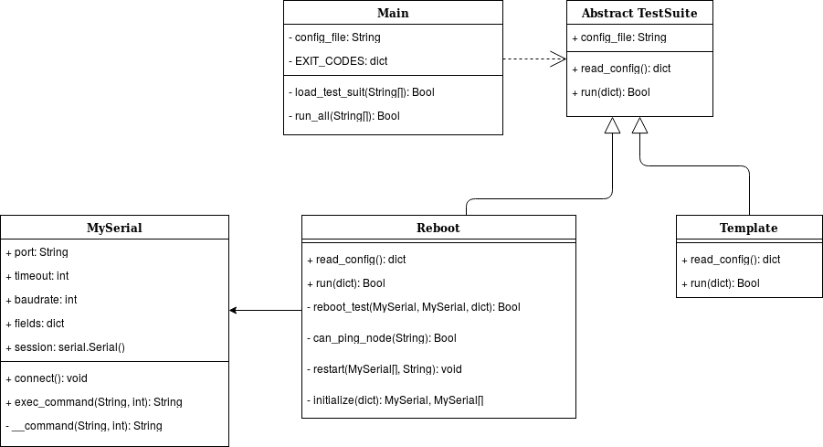

# serial\_testing

A simple test suite runner script, that executes newly added test scripts into new directories and main configuration file.

## installation
* `chmod 777 install.sh`
* `sudo ./install.sh`

## add new test
* `cd src`
* `cp -r template newtest`
* `edit src/config.ini (suite=['template.test', 'newtest.test'])`
* `edit newtest/test.py (RELATIVE_PATH='newtest/config.ini')`

## run all tests
* `close all minicom connections`
* `cd src`
* `sudo python main.py`

## Model Big Picture

This is an overview of the model. To keep things simple it only shows the more
important methods and some method bundles as a class.

